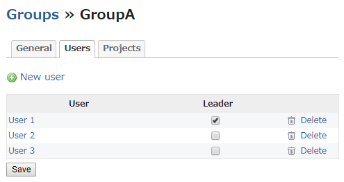
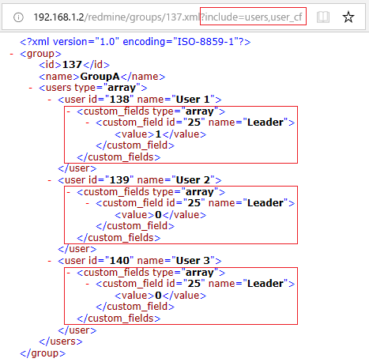

# Redmine plugin to add custom field to each user in group
This plugin add custom field to each user in group.  
  

You can set this custom field at New user dialog in group view.  

Then you can edit this custom field at Users tab in group view.  

To get custom field with REST API, add "user_cf" to parameter.  
ex. No Custom Field  
  

ex. With Custom Field

# Compatibility
This plugin version is compatible only with Redmine 3.x.

# Installation
1. Copy this plugin
    * Download files and copy this plugin into #{REDMINE_ROOT}/plugins.

    Or

    * Change current directory to your Redmine root directory:  

            cd {REDMINE_ROOT}/plugins/

      Copy this plugin from GitHub using the following commands:

            git clone https://github.com/minoru-nagasawa/redmine_custom_field_groups_user.git

2. Do migration task.

        bundle exec rake redmine:plugins:migrate RAILS_ENV=production

3. Restart Redmine.
